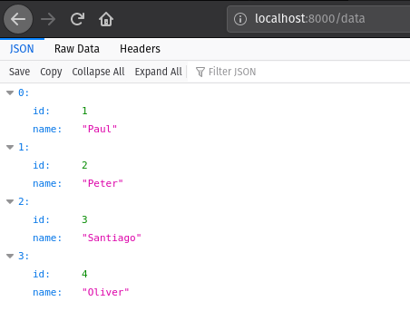

# coi-actix-sample

This project is designed to show off [`coi`] and its integration with [`actix-web`] through the [`coi-actix-web`] crate.

[`coi`]: https://github.com/Nashenas88/coi
[`actix-web`]: https://github.com/actix/actix-web
[`coi-actix-web`]: https://github.com/Nashenas88/coi-actix-web

## Prerequisites
docker is running, `psql` cli command is available

## Setup
Start off by creating the docker container and seeding it with sample data:

```
cargo xtask seed
```

Verify that the above executed successfully and that the docker instance is still running:
```
docker ps
```
You should see an output similar to:
```
CONTAINER ID        IMAGE                       COMMAND                  CREATED             STATUS              PORTS                     NAMES
48e4280dcf0c        coi-actix-sample-postgres   "/usr/lib/postgresql…"   29 seconds ago      Up 27 seconds       0.0.0.0:45432->5432/tcp   angry_allen
```

## Running

```
cargo run --release
```

And visit http://localhost:8000/data

You should see something like the following if you've visited the above url in firefox:

